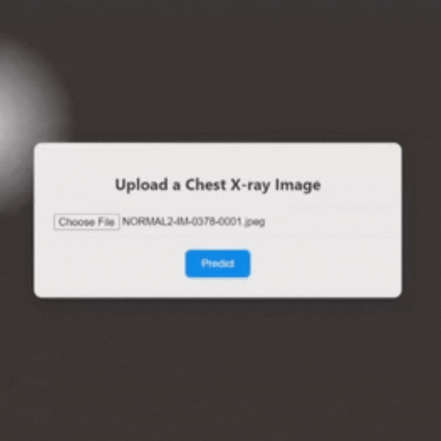

# Xray
Xray detection using deep learning

This project uses deep learning techniques to detect pneumonia from chest X-ray images. The model is built using TensorFlow/Keras and deployed as a web application using Flask. The user-friendly interface allows for easy image uploads and predictions.

### Tech Stack:
- **Python**
- **TensorFlow/Keras**
- **Flask**
- **HTML/CSS/JavaScript**

